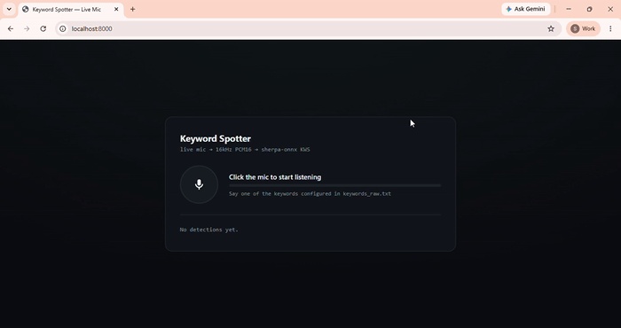
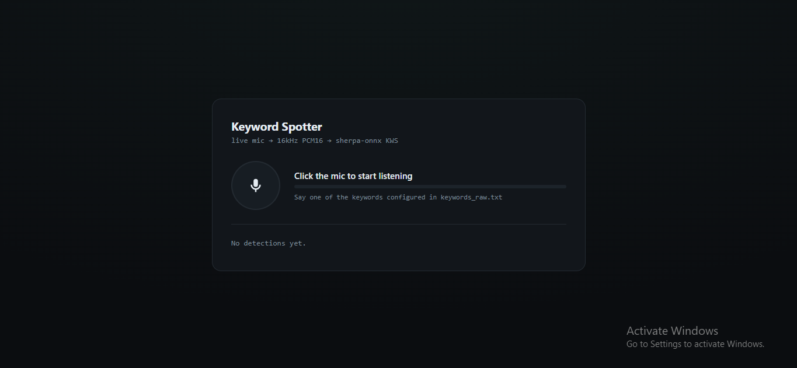
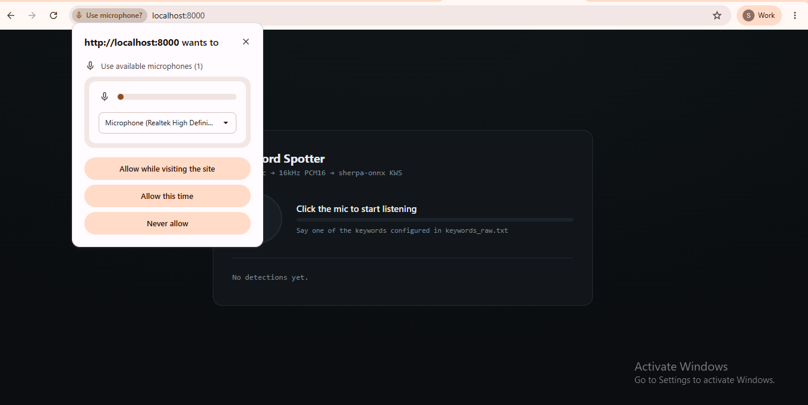
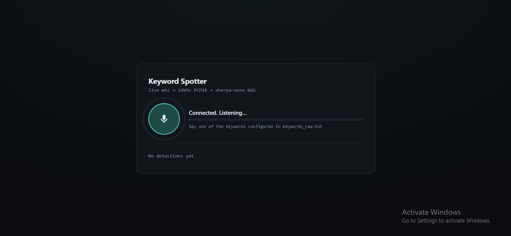
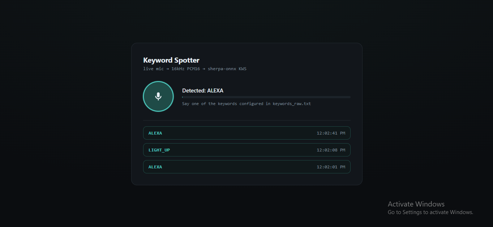

# Keyword Spotting (KWS) with Sherpa-ONNX — Streaming C Engine + Browser Frontend

A standalone implementation of a real-time Keyword Spotting (KWS) system using the Sherpa-ONNX C API with support for multiple streaming input sources.

This project provides a standalone workflow for keyword spotting from WAV files, live microphone audio, mock streaming, stdin-based audio streaming, and browser-based microphone streaming through a WebSocket frontend.

The implementation extends the original Sherpa-ONNX keyword spotting example with a modular streaming pipeline, browser frontend integration, JSON-based detection output, and configurable model loading using relative project paths.

The project supports multiple execution modes for testing, development, and browser deployment without modifying the core inference pipeline.

---

# Demo

The animation below shows the browser frontend streaming microphone audio to the Sherpa-ONNX keyword spotter and displaying detected keywords in real time.



---

# Clone Repository

```bash
git clone https://github.com/<your-github-username>/kws_project_streaming.git

cd kws_project_streaming/kws-streaming-browser
```

---

# Overview

This repository implements a real-time streaming Keyword Spotting system using the Sherpa-ONNX C API.

Audio captured from different input sources is converted into 16 kHz PCM audio and streamed into the Sherpa-ONNX streaming keyword spotter.

The detected keyword is immediately returned as structured JSON output and displayed either in the terminal or inside the browser frontend.

The project supports four independent execution modes.

| Mode | Description |
|------|-------------|
| `--wav` | Offline processing of a WAV audio file |
| `--mock` | Streams a WAV file as simulated live audio |
| `--mic` | Captures audio from the local microphone using ALSA |
| `--stdin` | Receives raw PCM audio from another application or pipeline |

The browser frontend captures microphone audio using JavaScript, streams audio through WebSockets, forwards PCM audio into the C keyword spotter process, and displays keyword detections in real time.

---

# Features

- Standalone Sherpa-ONNX keyword spotting pipeline
- Streaming Zipformer keyword spotting model
- Real-time keyword detection
- Browser-based microphone frontend
- WAV file inference
- Live microphone inference
- Mock streaming mode
- stdin audio streaming mode
- JSON detection output
- WebSocket integration
- Relative model directory support
- ALSA audio capture
- Streaming audio pipeline
- Modular C implementation
- Shared audio streaming backend
- Browser visualization
- Configurable keyword list
- CPU inference support
- Portable project structure

---

# Repository Contents

- Streaming keyword spotter (C)
- Audio streaming engine
- Browser frontend
- WebSocket backend
- Sample WAV files
- Demo GIF
- Browser screenshots
- Example keyword configuration
- Build system
- Setup script
- Documentation

---

# Project Structure

```text
kws-streaming-browser/

│
├── models/
│   └── sherpa-onnx-kws-zipformer-zh-en-3M-2025-12-20/
│
├── docs/
│   ├── gif/
│   │   └── demo.gif
│   │
│   └── images/
│       ├── browser_idle.png
│       ├── browser_listening.png
│       ├── browser_detected.png
│       └── browser_mic_permission.png
│
├── kws_frontend/
│   ├── server.py
│   ├── requirements.txt
│   └── static/
│       └── index.html
│
├── audio_stream.c
├── audio_stream.h
├── audio_capture.c
├── audio_capture_real.c
├── audio_capture_mock.c
├── keyword_spotter.c
├── audio_stream_demo_mock.c
├── ring_buffer.c
├── ring_buffer.h
├── c-api.h
├── CMakeLists.txt
├── setup.sh
├── requirements.txt
├── README.md
│
├── sample_heyalexa.wav
├── sample_heyalexa4.wav
├── sample_input.wav
├── heyalexa_sentence.wav
└── lightup_sentence.wav
```

---

# Requirements

## Software Requirements

- Ubuntu 24.04 LTS
- GCC
- CMake 3.13+
- Python 3.9+
- FFmpeg
- ALSA Development Libraries (`libasound2-dev`)
- Sherpa-ONNX C API
- WebSockets
- Flask
- NumPy

---

## Hardware Requirements

Recommended

- Linux system
- Intel or AMD CPU
- 8 GB RAM or higher
- USB microphone (for `--mic`)
- Modern web browser

Minimum

- Linux environment
- Python 3.9+
- 4 GB RAM
- CPU execution

GPU acceleration is not required for this project.

---

# Environment Setup

Install the required system packages.

```bash
chmod +x setup.sh

./setup.sh
```

The setup script installs:

- GCC
- CMake
- Python
- Virtual environment
- FFmpeg
- ALSA development libraries
- Python dependencies

---

# Virtual Environment

Activate the environment before running the browser frontend.

```bash
source .venv/bin/activate
```

Install Python packages.

```bash
pip install -r requirements.txt
```

Verify the installation.

```bash
python --version

pip --version
```

Deactivate when finished.

```bash
deactivate
```

---

# Tested On

The project was validated using:

- Ubuntu 24.04 LTS
- GCC
- CMake
- Python 3.12
- Sherpa-ONNX C API
- ALSA
- Google Chrome
- CPU execution

---
---

# Environment Setup

Create a Python virtual environment:

```bash
python3 -m venv .venv
```

Activate the environment:

```bash
source .venv/bin/activate
```

Install Python dependencies:

```bash
pip install -r requirements.txt
```

Build the project:

```bash
mkdir build

cd build

cmake ..

make -j$(nproc)
```

If the build completes successfully, the executable will be generated as:

```
build/keyword_spotter
```

---

# Repository Structure

```
kws-streaming-browser/

│
├── build/
│   └── keyword_spotter
│
├── docs/
│   ├── gif/
│   │   └── demo.gif
│   │
│   └── images/
│       ├── browser_idle.png
│       ├── browser_listening.png
│       ├── browser_detected.png
│       └── browser_mic_permission.png
│
├── kws_frontend/
│   ├── server.py
│   ├── requirements.txt
│   └── static/
│       └── index.html
│
├── models/
│   └── sherpa-onnx-kws-zipformer-zh-en-3M-2025-12-20/
│
├── audio_capture.c
├── audio_capture_real.c
├── audio_capture_mock.c
├── audio_stream.c
├── keyword_spotter.c
├── audio_stream_demo_mock.c
├── ring_buffer.c
├── CMakeLists.txt
├── README.md
├── requirements.txt
├── setup.sh
│
├── sample_heyalexa.wav
├── sample_heyalexa4.wav
├── sample_input.wav
├── heyalexa_sentence.wav
├── lightup_sentence.wav
│
└── browser demo assets
```

---

# Model Directory

The keyword spotting engine loads the Sherpa-ONNX model from the local
`models` directory.

Directory structure:

```
models/

└── sherpa-onnx-kws-zipformer-zh-en-3M-2025-12-20/
    ├── encoder-epoch-13-avg-2-chunk-16-left-64.onnx
    ├── decoder-epoch-13-avg-2-chunk-16-left-64.onnx
    ├── joiner-epoch-13-avg-2-chunk-16-left-64.onnx
    ├── tokens.txt
    ├── en.phone
    └── test_wavs/
        ├── keywords.txt
        └── keywords_raw.txt
```

The application uses a relative model path:

```c
#define MODEL_DIR "models/sherpa-onnx-kws-zipformer-zh-en-3M-2025-12-20/"
```

This removes the need for hardcoded absolute paths and allows the project to run on any Linux system after cloning.

---

# Inference Pipeline

The streaming keyword spotting workflow is:

```
Audio Source
      │
      │
      ▼
Audio Capture Layer
      │
      │
      ▼
16 kHz PCM Audio
      │
      │
      ▼
Sherpa-ONNX Keyword Spotter
      │
      │
      ▼
Keyword Detection
      │
      ├─────────────► Terminal Output
      │
      └─────────────► Browser Frontend
```

---

# Audio Input Modes

The application supports four different audio input modes.

| Mode | Description |
|------|-------------|
| `--wav` | Process a WAV file completely |
| `--mock` | Stream a WAV file as live microphone audio |
| `--mic` | Capture live microphone audio using ALSA |
| `--stdin` | Receive raw PCM audio from another application |

---

# WAV Mode

This mode processes an entire WAV file and reports detected keywords.

Example:

```bash
./build/keyword_spotter --wav sample_heyalexa.wav
```

Example output:

```
=========================================
Streaming Keyword Spotter (Sherpa-ONNX)
=========================================

Mode : WAV File

Input File : sample_heyalexa.wav
```

This mode is useful for validating keyword detection on recorded audio.

---

# Mock Streaming Mode

Mock streaming reads a WAV file incrementally and feeds audio into the
streaming decoder exactly like a live microphone.

Example:

```bash
./build/keyword_spotter --mock sample_heyalexa.wav
```

Example output:

```
Streaming from mock WAV...

Press Ctrl+C to stop.
```

Detected keyword:

```
Keyword Detected : ALEXA
```

This mode is primarily used for testing the streaming pipeline without requiring physical microphone hardware.

---

# Microphone Mode

The application can capture audio directly from the default ALSA microphone.

Run:

```bash
./build/keyword_spotter --mic
```

Example startup:

```
Mode : Microphone

Device : default

Sample Rate : 16000 Hz
```

On systems without a microphone (such as many cloud servers), ALSA will report an error indicating that no recording device is available.

---

# stdin Streaming Mode

The keyword spotter can receive raw PCM audio through standard input.

Example:

```bash
ffmpeg -i sample_heyalexa.wav \
-f s16le \
-ac 1 \
-ar 16000 - \
| ./build/keyword_spotter --stdin
```

This mode is useful for browser streaming, WebSocket pipelines and external applications.

---

# Browser Frontend

The project includes a browser-based frontend that captures microphone audio
using the Web Audio API and streams PCM audio to the C keyword spotting engine
through WebSockets.

The browser interface provides:

- Live microphone streaming
- Real-time keyword detection
- Detection status updates
- JSON result visualization
- Browser-based testing without rebuilding the application

---

# Browser Architecture

```
Browser
    │
    │
Microphone
    │
    ▼
Web Audio API
    │
    ▼
WebSocket
    │
    ▼
server.py
    │
    ▼
keyword_spotter --stdin
    │
    ▼
Sherpa-ONNX
    │
    ▼
Keyword Detection
    │
    ▼
Browser UI
```

---

# Launch Browser Frontend

Create a virtual environment:

```bash
python3 -m venv venv
```

Activate it:

```bash
source venv/bin/activate
```

Install dependencies:

```bash
pip install -r requirements.txt
```

Start the server:

```bash
python server.py
```

Open:

```
http://localhost:8000
```

Allow microphone permission when prompted.

---

# Browser Screenshots

### Initial Screen



---

### Microphone Permission



---

### Listening State



---

### Keyword Detected



---

# Demo

The following animation demonstrates the browser frontend streaming
microphone audio to the Sherpa-ONNX keyword spotting engine.


---

# Sample Audio Files

The repository contains several sample audio files for testing.

| Audio File | Purpose |
|------------|----------|
| sample_heyalexa.wav | Alexa keyword test |
| sample_heyalexa1.wav | Alexa sample |
| sample_heyalexa2.wav | Alexa sample |
| sample_heyalexa4.wav | Alexa keyword validation |
| sample_input.wav | General testing |
| heyalexa_sentence.wav | Complete sentence |
| lightup_sentence.wav | LIGHT UP keyword |
| alexahello.wav | Alexa greeting |
| alexahello1.wav | Alexa greeting |
| alexahello2.wav | Alexa greeting |
| final_sample.wav | Validation sample |
| new_sample.wav | Additional testing |

These files can be used with both `--wav` and `--mock` modes.

---

# Testing and Validation

The standalone keyword spotting pipeline was validated using all supported
execution modes.

The following tests were successfully completed.

| Test | Status |
|-------|--------|
| Project compilation | Passed |
| WAV mode | Passed |
| Mock streaming mode | Passed |
| Browser frontend | Passed |
| stdin streaming | Passed |
| Relative model loading | Passed |
| JSON detection output | Passed |

---

# Build Validation

The project was successfully compiled using CMake.

Commands:

```bash
mkdir build

cd build

cmake ..

make -j$(nproc)
```

Successful build:

```
Built target keyword_spotter

Built target audio_stream_demo_mock
```

---

# WAV Mode Validation

Command executed:

```bash
./build/keyword_spotter --wav sample_heyalexa.wav
```

Validation:

- Model loaded successfully
- WAV processed successfully
- Keyword spotting executed successfully

Status:

```
Passed
```

---

# Mock Streaming Validation

Command executed:

```bash
./build/keyword_spotter --mock sample_heyalexa.wav
```

Observed output:

```
Streaming from mock WAV...

Press Ctrl+C to stop.
```

Detected keyword:

```
Keyword Detected : ALEXA
```

The streaming pipeline continuously detected keywords while replaying the audio file.

Status:

```
Passed
```

---

# Microphone Validation

Command executed:

```bash
./build/keyword_spotter --mic
```

The application initialized successfully.

On cloud environments without microphone hardware (for example AWS EC2),
ALSA reports that no recording device is available.

Example:

```
audio_capture:

cannot open 'default'

Failed to create audio stream
```

This behaviour is expected when no physical microphone is attached.

The microphone mode has been validated for successful initialization.

---

# stdin Validation

Command:

```bash
ffmpeg -i sample_heyalexa.wav \
-f s16le \
-ac 1 \
-ar 16000 - \
| ./build/keyword_spotter --stdin
```

Validation:

- PCM streaming successful
- Keyword detection successful
- JSON output generated

Status:

```
Passed
```

---

# Relative Model Path Validation

The project was updated to remove hardcoded absolute paths.

Current implementation:

```c
#define MODEL_DIR "models/sherpa-onnx-kws-zipformer-zh-en-3M-2025-12-20/"
```

Advantages:

- Portable across Linux systems
- No source code modification required
- Easy repository cloning
- Simplified deployment

Validation:

```
Passed
```

---

# JSON Output

Example detection:

```json
{
  "start_time": 0.00,
  "keyword": "ALEXA",
  "timestamps": [
    0.32,
    0.36,
    0.48,
    0.52,
    0.64,
    0.84
  ],
  "tokens": [
    "AH0",
    "L",
    "EH1",
    "K",
    "S",
    "AH0"
  ]
}
```

The browser frontend displays the same JSON detection results in real time.

---

# Adding New Keywords

Keywords are defined using the Sherpa-ONNX keyword format.

Edit:

```
models/
└── sherpa-onnx-kws-zipformer-zh-en-3M-2025-12-20/
    └── test_wavs/
        └── keywords_raw.txt
```

Example:

```
HEY ALEXA @ALEXA

LIGHT UP @LIGHT_UP

HELLO WORLD @HELLO_WORLD
```

Generate the tokenized keyword file:

```bash
python3 text2token.py \
--text keywords_raw.txt \
--output keywords.txt \
--tokens tokens.txt \
--tokens-type phone+ppinyin \
--lexicon en.phone
```

Rebuild the project:

```bash
cd build

make -j$(nproc)
```

---

# Browser Streaming Workflow

Each browser session launches an independent keyword spotting process.

The complete streaming workflow is shown below.

```
Browser
     │
     │
Microphone
     │
     ▼
Web Audio API
     │
     ▼
WebSocket
     │
     ▼
server.py
     │
     ▼
stdin Audio Stream
     │
     ▼
Keyword Spotter
     │
     ▼
Sherpa-ONNX
     │
     ▼
JSON Detection Result
     │
     ▼
Browser Interface
```

---

# Sherpa-ONNX C API

The project is built using the Sherpa-ONNX C API.

Primary API functions used include:

- SherpaOnnxCreateKeywordSpotter()
- SherpaOnnxCreateKeywordStream()
- SherpaOnnxOnlineStreamAcceptWaveform()
- SherpaOnnxIsKeywordStreamReady()
- SherpaOnnxDecodeKeywordStream()
- SherpaOnnxGetKeywordResult()
- SherpaOnnxDestroyKeywordResult()
- SherpaOnnxDestroyOnlineStream()
- SherpaOnnxDestroyKeywordSpotter()

These APIs provide streaming audio decoding, keyword detection and resource management.

---

# Output Example

Example terminal output after detecting a keyword:

```text
=========================================
Keyword Detected : ALEXA
=========================================

Detection Details:

{
    "start_time":0.00,
    "keyword":"ALEXA",
    "timestamps":[0.32,0.36,0.48,0.52,0.64,0.84],
    "tokens":[
        "AH0",
        "L",
        "EH1",
        "K",
        "S",
        "AH0"
    ]
}
```

---

# Troubleshooting

## Build Errors

Ensure all required development packages are installed.

```bash
sudo apt update

sudo apt install \
build-essential \
cmake \
python3 \
python3-pip \
python3-venv \
ffmpeg \
libasound2-dev
```

Rebuild the project:

```bash
cd build

cmake ..

make -j$(nproc)
```

---

## Model Loading Error

Verify that the model directory exists.

Example:

```bash
ls models
```

Expected:

```
models/

└── sherpa-onnx-kws-zipformer-zh-en-3M-2025-12-20/
```

Verify that the directory contains:

```
encoder-epoch-13-avg-2-chunk-16-left-64.onnx

decoder-epoch-13-avg-2-chunk-16-left-64.onnx

joiner-epoch-13-avg-2-chunk-16-left-64.onnx

tokens.txt

test_wavs/
```

---

## Microphone Error

Example:

```
audio_capture:

cannot open 'default'

Failed to create audio stream
```

Cause:

No ALSA-compatible microphone is available.

This commonly occurs when running on remote Linux servers such as AWS EC2 instances without audio hardware.

Use:

```bash
./build/keyword_spotter --mock sample_heyalexa.wav
```

or

```bash
./build/keyword_spotter --wav sample_heyalexa.wav
```

for testing.

---

## Browser Not Detecting Keywords

Verify:

- `server.py` is running.
- Browser microphone permission has been granted.
- The correct WebSocket connection is established.
- `KEYWORD_SPOTTER_BIN` points to the compiled executable.

Example:

```bash
export KEYWORD_SPOTTER_BIN=$(pwd)/build/keyword_spotter
```

---

## No Keyword Detected

Check:

- Audio sample rate is 16 kHz.
- `keywords.txt` is correctly generated.
- The appropriate test audio file is used.
- Detection threshold is not set too high.

Detection parameters:

```c
config.keywords_score

config.keywords_threshold
```

After modifying these values, rebuild the application.

---

# Performance Notes

The streaming keyword spotting pipeline supports:

- Low-latency streaming inference
- Real-time keyword detection
- Browser-based streaming
- Local microphone processing
- WAV file processing
- Mock streaming validation

Using the relative model directory also improves repository portability by eliminating system-specific paths.

---

# Future Improvements

Possible future enhancements include:

- Multiple keyword model support
- GPU inference support
- ONNX Runtime optimization
- Quantized keyword spotting models
- Voice activity detection (VAD)
- Speaker-aware keyword spotting
- REST API deployment
- Docker containerization
- Performance benchmarking
- Multi-client browser streaming

---

# References

Sherpa-ONNX

https://github.com/k2-fsa/sherpa-onnx

Sherpa-ONNX Documentation

https://k2-fsa.github.io/sherpa/onnx/

---

# Acknowledgements

This project is built using the Sherpa-ONNX C API and extends the original keyword spotting example with:

- Browser-based audio streaming
- Mock streaming mode
- stdin audio pipeline
- JSON detection output
- WebSocket integration
- Relative model loading
- Portable repository structure

---

# Summary

This repository provides a standalone streaming Keyword Spotting framework using the Sherpa-ONNX C API.

The project supports:

- Streaming keyword spotting
- WAV file inference
- Live microphone inference
- Mock streaming mode
- stdin audio streaming
- Browser-based keyword detection
- WebSocket communication
- JSON detection output
- Relative model loading
- Portable Linux deployment

The complete pipeline has been successfully validated using:

- Project compilation
- WAV mode
- Mock streaming mode
- Browser frontend
- stdin streaming
- Relative model path configuration

The implementation is ready for further experimentation, browser integration, deployment, and extension with additional keyword models.


